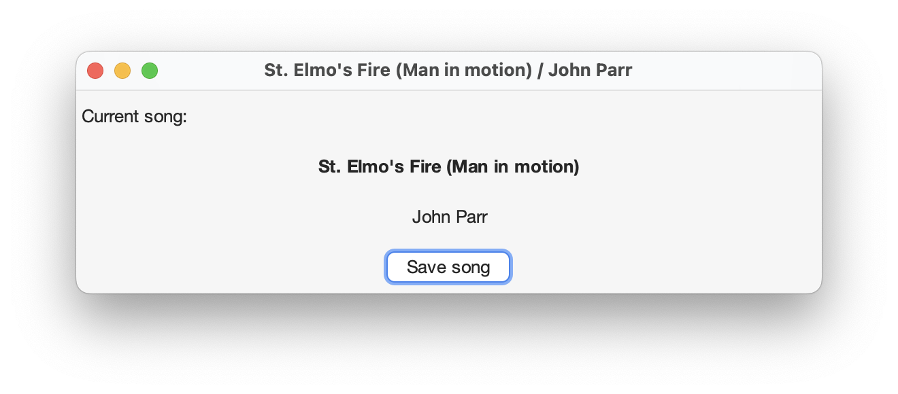

# Welcome to iSongs-RadioText!
iSongs-RadioText is a small Java application displaying the song currently playing on the radio.

It was extracted from the old iSongs project in 2014 and further developed as a standalone application.

iSongs-RadioText was rewritten in 2019 and 2023.

### Screenshots
<picture>
    <source srcset="screenshots/main_gui-light.png" media="(prefers-color-scheme: light), (prefers-color-scheme: no-preference)" />
    <source srcset="screenshots/main_gui-dark.png" media="(prefers-color-scheme: dark)" />
    
</picture>

#### Settings
<picture>
    <source srcset="screenshots/settings-light.png" media="(prefers-color-scheme: light), (prefers-color-scheme: no-preference)" />
    <source srcset="screenshots/settings-dark.png" media="(prefers-color-scheme: dark)" />
    
</picture>

## Usage
### Installation
In order to get started, simply download the latest release [here][2] and install it.

#### Building from source
You can build iSongs-RadioText yourself using Gradle.

Make sure you have installed a Java Development Kit in version 19 or higher. It should include `jmods`.

> [!NOTE]
> On **Linux** the package `rpm-build` (Red Hat Linux) or `fakeroot` (Ubuntu Linux) is
> needed to create an installation archive.
> 
> On **macOS** the Xcode command line tools are required for creating an installation image.

The following command creates an installation image for your platform:
```shell
./gradlew deploy
```
After running the above command successfully, you can install the generated installation archive.

### Using iSongs-RadioText
The songs are recognized by querying the JSON file from the web player of your radio station.

> [!NOTE]
> The URI to this file needs to be set in the [settings of iSongs-RadioText][4].

The recognized name and interpreter of the currently played song can be saved into a file.

> [!NOTE]
> The path where to store these files can be set in the [settings of iSongs-RadioText][4].

#### Apple Events on macOS
On macOS, the songs can alternatively or additionally be recognized by sending Apple Events to the
[Music App][3]. This implies the usage of the web radio feature of the [Music App][3].

> [!TIP]
> The Apple Events can be enabled in the [settings of iSongs-RadioText][4].

## Final notes
This project is licensed under the terms of the GNU GPL 3.0.

© Copyright 2014, 2019, 2023 - 2024 [mhahnFr][1]

[1]: https://github.com/mhahnFr
[2]: https://github.com/mhahnFr/iSongs-RadioText/releases/latest
[3]: https://www.apple.com/de/apple-music/
[4]: #settings